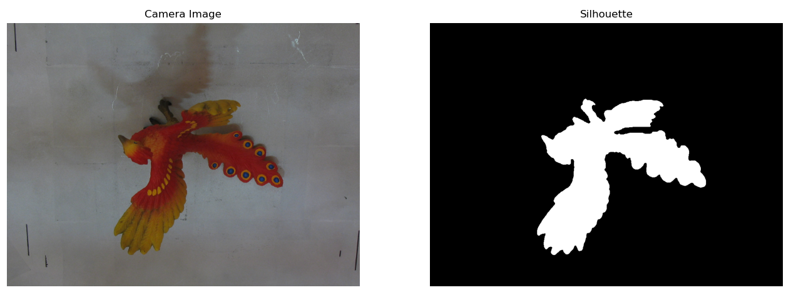
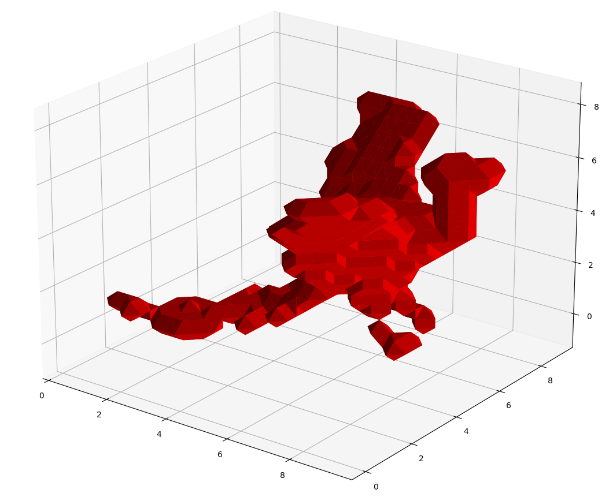
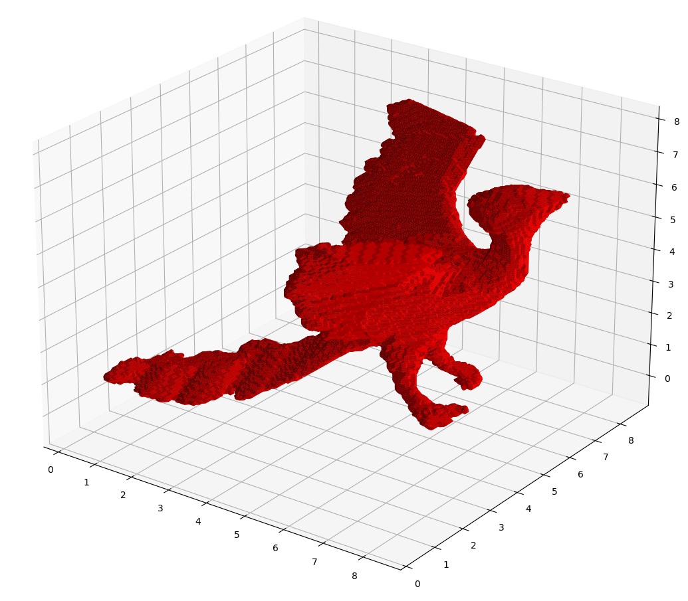

# Space Carving of Voxels for Building 3D Models

Contours of an object from various viewpoints provide an immense amount of information about the object 3D geometry. This requires the ability to compute object silhouette from image plane projection, and then enforcing consistency across multiple views.

We start from an initial volume of voxels and then carve away the voxels that do not exist within the visual cone for the object silhouette in the image space. We do this for each camera and compute the intersection of all visual cones to eventually obtain a visual hull.

If we have enough viewpoints available and the corresponding camera poses known, then this visual hull will correspond to a good 3D model representation of the object.

When we do not enforce a tight bound on the object dimensions, we end up with a 3D model which is very coarse like shown below.  

  

By doing a quick coarse estimation first, and then using that to estimate a better bound, we can build a find 3D model with same number of voxels. This is shown in the figure below.  

